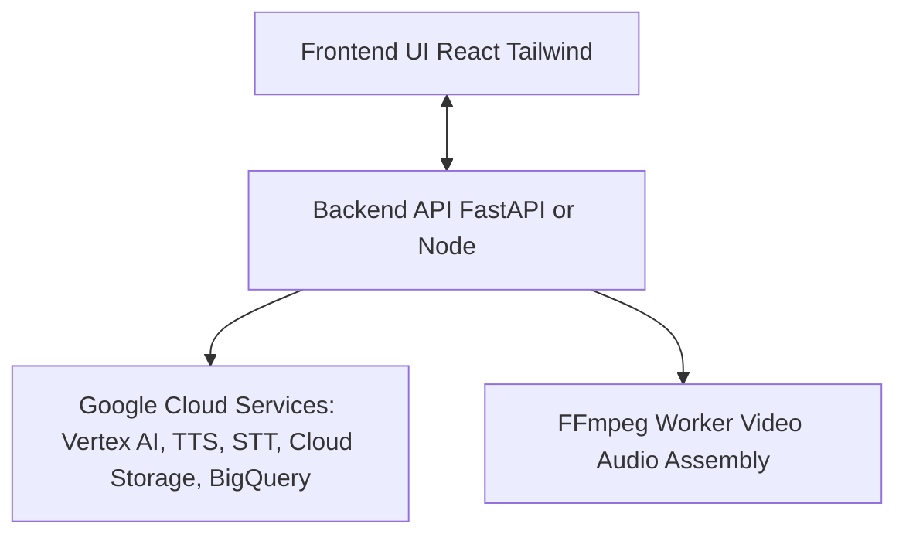

# 🎥 TrendTales  
*Giving artisans a digital voice through AI-powered storytelling & trend insights*

---

## 🚀 Project Overview
Indian artisans hold centuries of cultural heritage, but many lack access to modern digital marketing tools. **TrendTales** helps bridge this gap by transforming an artisan’s **voice note + photo** into a **ready-to-post Instagram reel**, complete with captions, hashtags, and trend recommendations.

Built during a hackathon, this MVP combines **AI-generated content** and **real-time trend analysis** to make digital storytelling **simple, accessible, and impactful**.

---

## ✨ Features
- 🎤 **Voice-to-Story Conversion** – Upload a raw 20s artisan voice note → clean transcript → AI narration.  
- 🖼️ **Photo-to-Reel Generation** – Artisan image + narration combined into a vertical reel with subtitles.  
- 🤖 **AI-powered Narration & Captions** – Vertex AI generates reel script, catchy captions, and hashtags.  
- 🎶 **Audio Enhancement** – Denoised voice + background music mixing for professional feel.  
- 📊 **Trend Insights** – Google Trends + social signals to suggest hashtags, styles, and best posting times.  
- 📱 **Ready-to-Post Reel** – Download Instagram-ready video (1080×1920).  

---

## 🏗️ Architecture




---

## 🔧 Tech Stack
**Frontend**: React, Tailwind CSS  
**Backend**: FastAPI (Python), Node (optional)  
**Media Processing**: FFmpeg, pydub, noisereduce, pysubs2  
**AI & Cloud**:  
- Google Cloud Vertex AI (Speech-to-Text, Text-to-Speech, LLM)  
- Google Vision API (optional image tagging)  
- Google BigQuery (trend storage & analysis)  
**Data**: Google Trends API (pytrends), mock Etsy/Instagram/Pinterest data  

---

## ⚙️ Installation & Setup

### 1️⃣ Clone repo
```bash
git clone https://github.com/your-username/trendtales.git
cd trendtales
```

## 2️⃣ Backend setup
```
cd backend
pip install -r requirements.txt
uvicorn app:app --reload
```

## 3️⃣ Frontend setup
```
cd frontend
npm install
npm start
```

## 4️⃣ FFmpeg setup

Make sure FFmpeg is installed:

```
ffmpeg -version
```

---

## 🎯 Usage

- Upload artisan image + 20s voice note.

- Click Generate Reel.

- Wait for processing → Preview final reel.

- Copy recommended caption & hashtags.

- Download reel (ready for Instagram).

---

## 📊 Example Output

- ✅ Input: Artisan photo + Hindi voice note about handmade pottery
- ✅ Output:

- 🎥 Instagram reel (20s, subtitles, background music)

- 📝 Caption: “Handmade with love ❤️ Discover timeless pottery crafted by local artisans.”

- 🔖 Hashtags: #Handmade #PotteryLove #IndianCraft #EcoFriendly #SupportLocal

- ⏰ Best posting time: 7 PM IST

---

## 🌍 Impact

- 🎨 Empowers artisans to tell authentic stories.

- 📈 Boosts online visibility with trend-backed recommendations.

- 💸 Increases sales through engaging digital presence.

---

## 📌 Roadmap

- Multi-image reels with scene transitions

- Direct posting to Instagram/Facebook via API

- Multi-language translation (regional → English captions)

- Advanced analytics dashboard

---

## 👥 Team Members

- Akshat Gupta 
- Kuldeep Panwar
- Sanskar Solanki
- Nikunj Rathi
---


## 🏆 Hackathon Note

This project was built as an MVP during a 48-hour hackathon. Some trend data and API calls are mocked for demonstration purposes. Future versions will integrate live APIs for production use.
